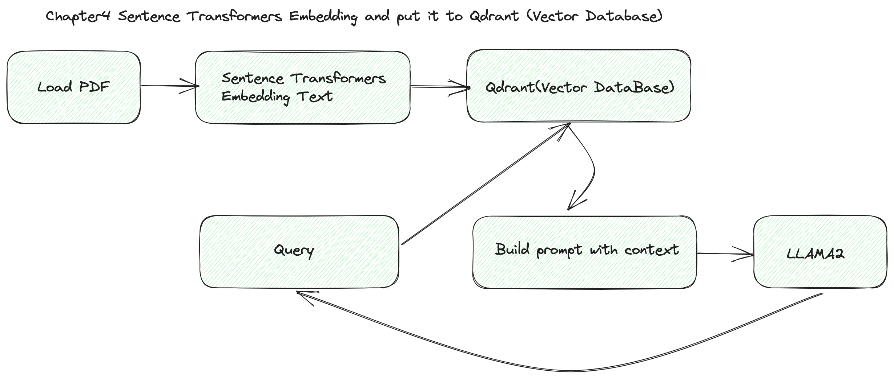

# Chapter 4: Store  embedding data with vector database Qdrant with vLLM

In chapter4 , We already show you how to embedding pdf text and use vector database Qdrant search it ,  in this chapter we should show you how to improve inference performance with vLLM .




#### Step1. Start Qdrant 

You need install docker , and start Qdrant one command .

```bash
docker pull qdrant/qdrant
docker run -p 6333:6333 qdrant/qdrant
```


### Step2. Coding with Qdrant

We  need create collection used qdrant python client before we use it,  `recreate_collection` always create new collection , if name exists Qdrant drop it and create , so you need very care for if you use it for production environment .

Notice we use `recreate_collection`, so every time when you start chapter4.py , you get new collection with same name ,  not use `recreate_collection` func in your production environment if you don't know how it works.

```py
#step1 create vector collection
connection.recreate_collection(
     collection_name="embedding_with_qdrant",
     vectors_config=models.VectorParams(size=256,distance=models.Distance.COSINE)
)
```

Then we  embedding our text with sentence_transformers and create `PointStuct` ,  put it into Qdrant collection

```python
#load embedding model, you can choice your embedding model
embedder = SentenceTransformer('all-MiniLM-L6-v2')
embedder.encode(your_input, convert_to_tensor=False).tolist()

#create Qdrant PointStruct and put it into collection
point=PointStruct(id=point_id,vector=embeddings,payload=payload)

operation_info= connection.upsert(
            collection_name=collection_name,
            wait=True,
            points=[point]
        )
```


### Step3  Upgrade chatper3.py used Qdrant store embedding data

Now ,  we can rewrite chatper3.py to chapter4.py,  we used Qdrant store our embedding data ,  you can found in qdrant_tools.py and embedding.py


```bash
#now you can load pdf or json from folder , just setup --file_path, the whole in the path data should be loaded.
python chapter4.py  --model_name ../../../Llama2/models/llama-2-13b-chat-hf --interaction --file_path ../../pdf --file_ext_name .pdf
```


