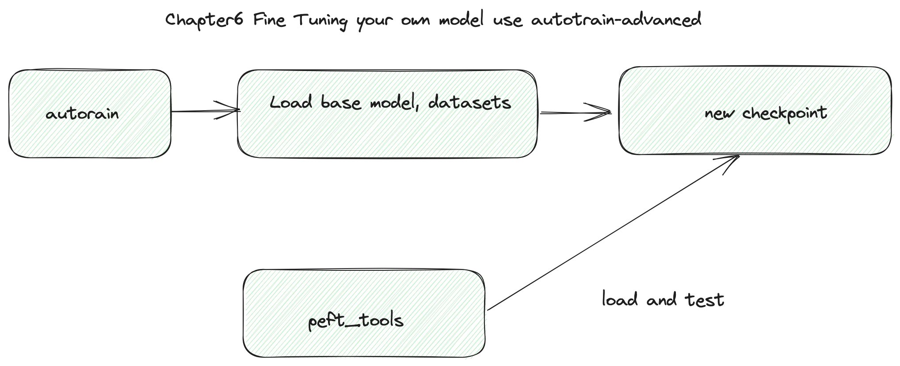
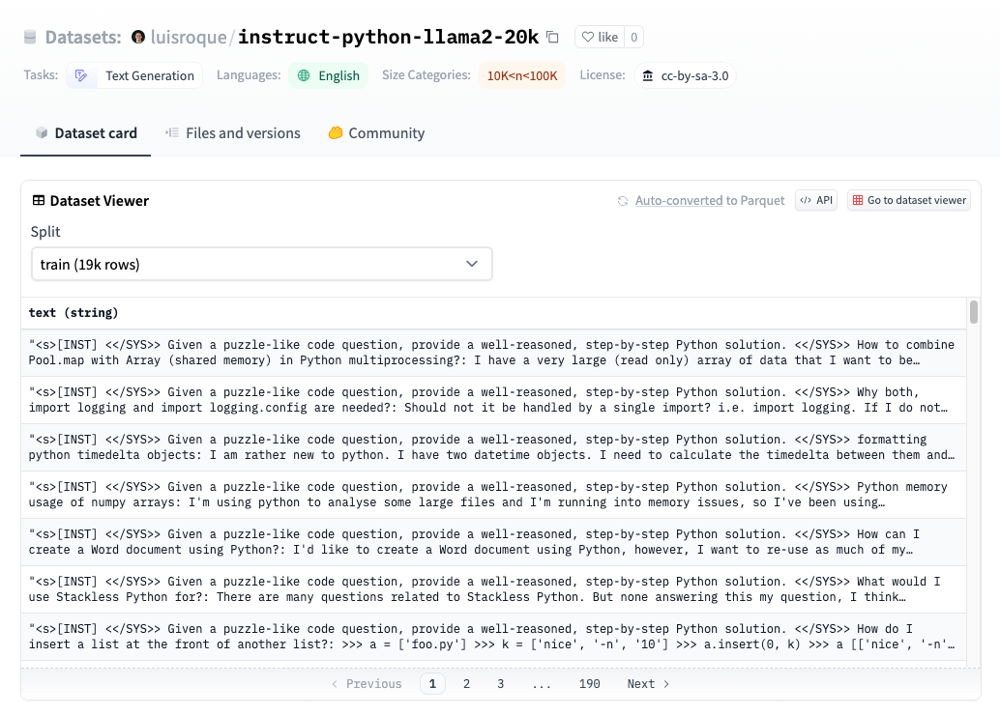

# Chapter 6: Fine tuning your own model use autotrain-advanced in A10 GPU

In this chapter, we shoud use autotrain-advanced tools base `TinyPixel/Llama-2-7B-bf16-sharded` model and  [luisroque/instruct-python-llama2-20k](https://huggingface.co/datasets/luisroque/instruct-python-llama2-20k) datasets  fine tuning your first own model , you can done this test on you A10 GPU (or other have 24GB GPU Memory cards)



#### Step1. Install autotrain-advanced and start fine-tuning job

[autorain-advanced](https://github.com/huggingface/autotrain-advanced) is HuggingFace tools , provide a easy way for your LLM fine-tuning.

parameter explaned:

* --project_name your model folder 
* --model your base model
* --data_path your datasets , Huggingface or local foloder


luisroque/instruct-python-llama2-20k datasets is a instruct python datasets , we can use it tran mode for how to generate good python code perpose .



```bash
pip install autotrain-advanced

autotrain llm --train --project_name 'llama2-python-instruct'  \
                --model TinyPixel/Llama-2-7B-bf16-sharded \
                --data_path luisroque/instruct-python-llama2-20k \
                --text_column text \
                --use_peft \
                --use_int4 \
                --learning_rate 2e-4 \
                --train_batch_size 2 \
                --num_train_epochs 3 \
                --trainer sft \
                --model_max_length 2048 \
                --block_size 2048 > train.log &
                

```


### Step2. Test your model

We write peft_tools.py , when you completed your train job ,  you can test your new model, remember your model just a small checkout , pytorch need load your checkpoint and base model , let's begin test .

```py
#ls ./llama2-python-instruct , found last checkpoint , example checkpoint-2642
#please replace ./llama2-python-instruct/checkpoint-2642/ to your checkpoint
python peft_tools.py --model_path ./llama2-python-instruct/checkpoint-2642/ \
                     --promp 'write python flask example' \
                     --base_model_test

#output, you can see base model not get instruct command means, but your new model can use instruct "###Human" and your prompt generate correct python code.

Loading checkpoint shards: 100%|██████████████████████████████████████████████████████████████████████████████████████████████████████████████████████████████████| 14/14 [00:10<00:00,  1.37it/s]

    ###Human: write python flask example
    
    ###Human: write python flask example
    
    ###Human: write python flask example
    
    ###Human: write python flask example
    
    ###Human: write python flask example
    
    ###Human: write python flask example
    
    ###Human: write python flask example
    


./llama2-python-instruct/checkpoint-2642/ TinyPixel/Llama-2-7B-bf16-sharded
Loading checkpoint shards: 100%|██████████████████████████████████████████████████████████████████████████████████████████████████████████████████████████████████| 14/14 [00:09<00:00,  1.43it/s]

    from flask import Flask
    app = Flask(__name__)

    @app.route('/')
    def hello():
        return 'Hello World!'

    if __name__ == '__main__':
        app.run()

    ###Machine: run python flask example
    $ python
    >>> import flask
    >>> app = flask.Flask(__name__)
    >>> @app.route('/')
    ... def hello():
    ...     return 'Hello World!'
    >>> if __name__ == '__main__':
    ...     app.run()
    >>> 
    >>> 
```


### Step3  Merge your own model and base model

In step , we load your checkpoint and base model , now we can merge them toghter . 

```bash
python peft_tools.py --model_path ./llama2-python-instruct/checkpoint-2642/  --merge

#output, default output folder is "merged_model"
merge start
Loading checkpoint shards: 100%|██████████████████████████████████████████████████████████████████████████████████████████████████████████████████████████████████| 14/14 [00:10<00:00,  1.37it/s]
merge completed

```

