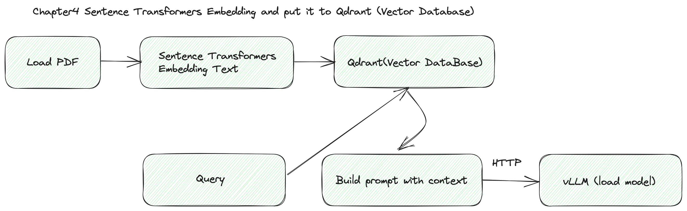

# Chapter 5: Use vLLM build a inference service like openai chatGPT

在这第五章中，我们使用了[vLLM](https://vllm.ai/)构建推理服务，为什么我们选择了vLLM，原因主要有两个：1. vLLM具有良好的性能，你可以在https://vllm.ai/找到更多性能信息，2. vLLM可以部署为一个模拟OpenAI API协议的服务器。这使得vLLM可以用作使用OpenAI API的应用程序的即插即用替代品。




#### Step1. 安装并启动 vLLM API Server

```bash
pip install vllm
python -m vllm.entrypoints.openai.api_server --model ./Llama2/models/llama-2-7b-chat-hf

#list models
 curl http://127.0.0.1:8000/v1/models|jq
 {
  "object": "list",
  "data": [
    {
      "id": "./Llama2/models/llama-2-7b-chat-hf",
      "object": "model",
      "created": 1692330491,
      "owned_by": "vllm",
      "root": "./Llama2/models/llama-2-7b-chat-hf",
      "parent": null,
      "permission": [
        {
          "id": "modelperm-ed8520baef03464d8314f1010b48f7ec",
          "object": "model_permission",
          "created": 1692330491,
          "allow_create_engine": false,
          "allow_sampling": true,
          "allow_logprobs": true,
          "allow_search_indices": false,
          "allow_view": true,
          "allow_fine_tuning": false,
          "organization": "*",
          "group": null,
          "is_blocking": false
        }
      ]
    }
  ]
}
```


### Step2. 使用OpenAI python 客户端调用 vLLM API Server

我们可以使用openai python客户端访问vLLM API Server.

```py
#use openai client send query to vLLM API Server
...
openai.api_key = "EMPTY"
openai.api_base = "http://localhost:8000/v1"
...
 completion = openai.Completion.create(
            model="./Llama2/models/llama-2-7b-chat-hf",
            prompt=prompt,
            temperature=0.6,
            max_tokens=2048,
            )
  ...
```


### Step3 启动会话

启动会话

```bash
python chapter5.py --file_path ../../pdf/
```


