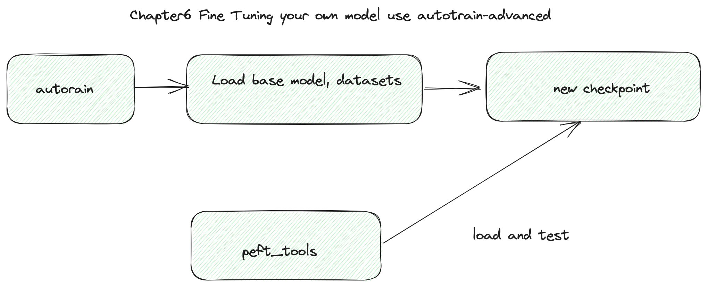
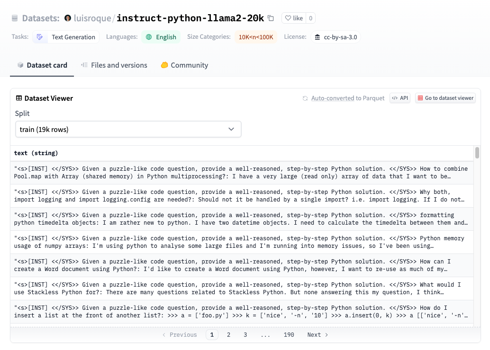

# Chapter 6: 使用"autotrain-advanced"来微调您自己的模型 


在这一章节中，我们应该使用"autotrain-advanced"工具，基于"TinyPixel/Llama-2-7B-bf16-sharded"模型和[luisroque/instruct-python-llama2-20k](https://huggingface.co/datasets/luisroque/instruct-python-llama2-20k) 数据集，来微调您自己的第一个模型。您可以在您的A10 GPU (或其他拥有24GB GPU内存的显卡)上进行测试



#### Step1. 安装 autotrain-advanced 并开始微调任务

[autotrain-advanced](https://github.com/huggingface/autotrain-advanced) 是一个 HuggingFace 提供的训练工具,  它可以让你非常方便的进行模型微调。

autotrain参数说明:

* --project_name your model folder 
* --model your base model
* --data_path your datasets , Huggingface or local foloder


luisroque/instruct-python-llama2-20k 数据集是一个 instruct python 数据集，我们可以使用它来训练模型，以生成良好的 Python 代码。 



```bash
pip install autotrain-advanced

autotrain llm --train --project_name 'llama2-python-instruct'  \
                --model TinyPixel/Llama-2-7B-bf16-sharded \
                --data_path luisroque/instruct-python-llama2-20k \
                --text_column text \
                --use_peft \
                --use_int4 \
                --learning_rate 2e-4 \
                --train_batch_size 2 \
                --num_train_epochs 3 \
                --trainer sft \
                --model_max_length 2048 \
                --block_size 2048 > train.log &
                

```


### Step2. 测试你的模型

我们编写了一个名为 peft_tools.py 的文件。当您完成训练作业后，您可以测试您的新模型。请记住，您的模型只是一个小的checkpoint，PyTorch 需要加载您的checkpoint和基础模型，让我们开始测试。

```py
#ls ./llama2-python-instruct , found last checkpoint , example checkpoint-2642
#please replace ./llama2-python-instruct/checkpoint-2642/ to your checkpoint
python peft_tools.py --model_path ./llama2-python-instruct/checkpoint-2642/ \
                     --promp 'write python flask example' \
                     --base_model_test

#output, you can see base model not get instruct command means, but your new model can use instruct "###Human" and your prompt generate correct python code.

Loading checkpoint shards: 100%|██████████████████████████████████████████████████████████████████████████████████████████████████████████████████████████████████| 14/14 [00:10<00:00,  1.37it/s]

    ###Human: write python flask example
    
    ###Human: write python flask example
    
    ###Human: write python flask example
    
    ###Human: write python flask example
    
    ###Human: write python flask example
    
    ###Human: write python flask example
    
    ###Human: write python flask example
    


./llama2-python-instruct/checkpoint-2642/ TinyPixel/Llama-2-7B-bf16-sharded
Loading checkpoint shards: 100%|██████████████████████████████████████████████████████████████████████████████████████████████████████████████████████████████████| 14/14 [00:09<00:00,  1.43it/s]

    from flask import Flask
    app = Flask(__name__)

    @app.route('/')
    def hello():
        return 'Hello World!'

    if __name__ == '__main__':
        app.run()

    ###Machine: run python flask example
    $ python
    >>> import flask
    >>> app = flask.Flask(__name__)
    >>> @app.route('/')
    ... def hello():
    ...     return 'Hello World!'
    >>> if __name__ == '__main__':
    ...     app.run()
    >>> 
    >>> 
```


### Step3  合并PEFT模型和基础模型

在这一步中，我们加载您的checkpoint和基础模型，现在我们可以将它们合并在一起。

```bash
python peft_tools.py --model_path ./llama2-python-instruct/checkpoint-2642/  --merge

#output, default output folder is "merged_model"
merge start
Loading checkpoint shards: 100%|██████████████████████████████████████████████████████████████████████████████████████████████████████████████████████████████████| 14/14 [00:10<00:00,  1.37it/s]
merge completed

```

